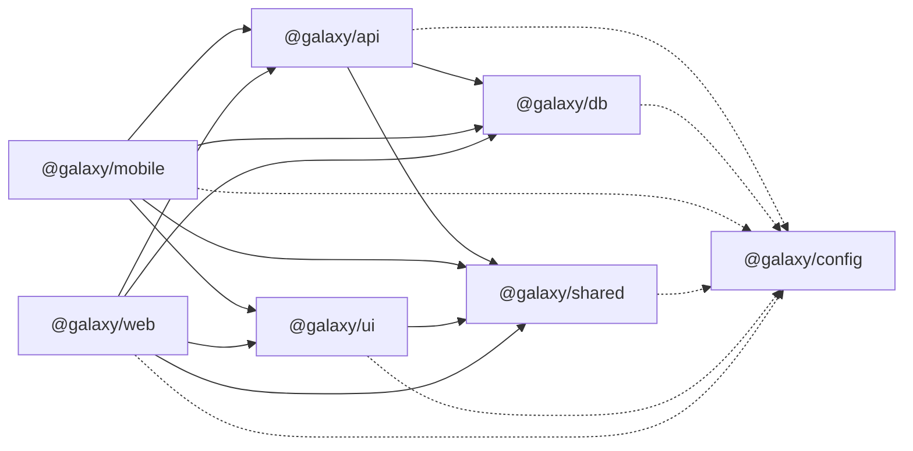

<!-- generated by scripts/gen-dependency-graph.mjs — do not edit -->

# Workspace Dependency Graph

Regenerate with `node scripts/gen-dependency-graph.mjs`. CI checks freshness (Architecture Gates job).

